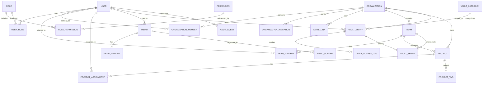

# Organization Management Platform — Architecture

This document describes the architecture, conventions, and design decisions for the production-ready backend. It is intentionally written before implementation so that every subsequent module has a clear home and set of rules.

---

## 1. Goals

- **Modular**: Each domain (auth, users, orgs, teams, projects, memos, vault, permissions, audit, notifications) lives in its own module.
- **Clean / DDD**: Domain models own business rules; routers are thin; services orchestrate; repositories persist.
- **Secure**: Argon2, JWT with refresh rotation, RBAC, field-level encryption for the vault, audit logging, rate limiting, CORS, secure headers.
- **Testable**: Async SQLAlchemy test DB, factories, repository + service + endpoint tests, >= 90% coverage target.
- **Observable**: request IDs, structured logging, IP + device tracking, centralized exception handling.
- **Deployable**: Docker, Docker Compose, health checks, Alembic migrations, CI/CD.

---

## 2. Tech Stack

| Layer | Choice |
| --- | --- |
| Language | Python 3.14+ (async/await) |
| Web framework | FastAPI |
| Validation | Pydantic v2 |
| ORM | SQLAlchemy 2.0 (async) |
| Migrations | Alembic |
| Database | PostgreSQL 16+ |
| Cache / Session / RL | Redis 7+ |
| Password hashing | Argon2 (`argon2-cffi`) |
| JWT | `python-jose[cryptography]` + `cryptography` |
| Vault encryption | AES-256-GCM via `cryptography` |
| Task / events | In-process async queue for audit (can migrate to Celery) |
| Testing | `pytest`, `pytest-asyncio`, `httpx`, `factory-boy`, `faker` |
| Lint / format | `ruff`, `black`, `mypy` |
| Pre-commit | `pre-commit` |
| CI/CD | GitHub Actions |

---

## 3. Project Structure

```
app/
    core/               # config, db, logging, security, middleware, cache, base exceptions, di
    auth/               # authentication domain
    users/              # user profile domain
    permissions/        # RBAC: permissions, roles, user roles
    organizations/      # orgs, memberships, invitations, invite links
    teams/              # teams and team memberships
    projects/           # projects, assignees, statuses
    memos/              # notes, folders, tags, versions, favorites
    vault/              # encrypted secrets, sharing, audit events
    audit/              # audit log table and service
    notifications/      # notification model and dispatch helpers
    common/             # shared utilities, pagination, base schemas, generic CRUD helpers

tests/                  # mirrors app/ structure
alembic/                # migrations + env
scripts/                # local helpers
.github/workflows/      # CI/CD
```

Every module follows this internal layout:

```
module/
    __init__.py
    models.py        # SQLAlchemy domain models
    schemas.py       # Pydantic request/response models
    repository.py    # repository pattern (DB access only)
    service.py       # business logic and orchestration
    router.py        # FastAPI HTTP routes
    dependencies.py  # route dependencies (current user, perms, etc.)
    exceptions.py    # module-specific exceptions
    tests/           # unit + integration tests for this module
```

---

## 4. Layered Architecture

```
┌─────────────────────────────────────┐
│  Presentation (FastAPI routers)     │  parse input, call services, return responses
├─────────────────────────────────────┤
│  Application (services)             │  orchestrate repositories, enforce rules, emit audit events
├─────────────────────────────────────┤
│  Domain (models)                    │  SQLAlchemy entities + business invariants
├─────────────────────────────────────┤
│  Infrastructure (repositories, db,    │  persistence, cache, security primitives, logging
│  redis, encryption, middleware)     │
└─────────────────────────────────────┘
```

Rules of the road:

1. Routers **never** contain business logic. They validate, authorize, and delegate.
2. Services **never** import `async_session`. They receive repositories via FastAPI dependencies.
3. Repositories **only** perform data access, paginate, and enforce query filters (e.g. `deleted_at is None`).
4. Domain models are SQLAlchemy 2.0 declarative classes with `UUID` primary keys, audit timestamps, and optimistic locking (`version`).
5. Exceptions are centralized in `app/core/exceptions.py` and mapped to HTTP responses in a single exception handler.

---

## 5. Cross-Cutting Concerns

### 5.1 Database Conventions

- UUID primary keys (UUID7 / `uuid.uuid4` fallback).
- `created_at`, `updated_at`, `deleted_at` on every table.
- `created_by`, `updated_by` where ownership/audit is needed.
- `version` integer for optimistic locking.
- Soft delete: `deleted_at` is set instead of `DELETE`.
- Indexes on foreign keys, search fields, and frequently filtered columns.
- Unique constraints respect `deleted_at` via partial indexes where needed (e.g. `email` for non-deleted users).

### 5.2 Base Repository (generic CRUD)

`app/common/repository.py` provides a generic `BaseRepository[T]` with:

- `get(id)`
- `get_or_404(id)`
- `list(filter, pagination, sort)`
- `create(entity)`
- `update(entity, data)`
- `delete_soft(entity)` / `delete_hard(entity)`

Domain repositories extend it and add module-specific queries.

### 5.3 Pagination / Filtering / Sorting / Search

Standard request schema:

```json
{
  "page": 1,
  "page_size": 20,
  "sort": "-created_at",
  "search": "keyword",
  "filters": { "status": "active" }
}
```

Response schema:

```json
{
  "success": true,
  "data": [...],
  "pagination": { "page": 1, "page_size": 20, "total": 100, "pages": 5 }
}
```

### 5.4 Standardized API Responses

```json
{
  "success": true | false,
  "message": "...",
  "code": "OK | VALIDATION_ERROR | ...",
  "data": {} | null,
  "errors": []
}
```

Implemented via a response wrapper in `app/common/responses.py` and a global exception handler.

---

## 6. Authentication

- Registration with email verification token (Redis).
- Login checks Argon2 hash, creates Redis session, returns JWT access + refresh tokens.
- Refresh endpoint validates refresh token and issues a new access token (and optionally rotates refresh token).
- Logout deletes the Redis session and blacklists the access token until expiry.
- Password reset uses a time-limited Redis token.
- Change password requires current password.
- Revoke sessions removes all Redis sessions for a user (or a specific device).
- Remember Me extends refresh token lifetime on trusted devices.
- Device tracking: store `user_agent`, `ip`, `fingerprint` on session creation.
- Failed login attempts are tracked in Redis; after threshold, account lockout for a cooldown period.

Dependencies:
- `get_current_user(token)` → `User` from Redis session + JWT.
- `get_current_active_user` → verified + not locked.

---

## 7. Authorization (RBAC)

Entities:
- `Permission` (resource + action)
- `Role` (named set of permissions)
- `UserRole` (user ↔ role ↔ organization/team scope)

Built-in roles:
- `super_admin`, `organization_admin`, `team_admin`, `project_manager`, `member`, `guest`.

Permissions are strings like `organization:read`, `project:update`, `vault:delete`.

Authorization dependency factory:

```python
require_permission("organization:update")
require_any_permission(["project:create", "team:admin"])
require_role("organization_admin")
```

Scopes can be global, organization-scoped, or team-scoped. Checks look at the user's roles that apply to the requested resource context.

---

## 8. Domain Modules (Brief)

### 8.1 Users
- `User` model with email, password hash, full name, avatar, email verified flag, account status.

### 8.2 Organizations
- `Organization`, `OrganizationMember`, `OrganizationInvitation`, `InviteLink`.
- Owner has implicit `organization_admin` role. Invitations can be email-based or link-based.
- Members can have multiple roles per org.

### 8.3 Teams
- `Team`, `TeamMember`. Users may belong to multiple teams. Team admins can manage team membership.

### 8.4 Projects
- `Project` with title, description, status, priority, due date, tags, owner, org FK, assignees.
- Features: CRUD, archive/restore, search, pagination, optimistic locking.

### 8.5 Memos
- `Memo`, `MemoFolder`, `MemoTag`, `MemoVersion`.
- Folders, tags, markdown, pinned, favorites, soft delete, version history, search.

### 8.6 Vault
- `VaultEntry`, `VaultCategory`, `VaultShare`, `VaultAccessLog`.
- Field-level AES-256-GCM encryption of sensitive fields (password, API key, SSH key, DB credentials, etc.).
- Master key from environment; derived data encryption key (DEK) per entry or per organization (configurable).
- Categories, tags, expiration, sharing with users/teams, audit access, rotation reminders.

### 8.7 Audit
- `AuditEvent` table records: actor, action, resource type, resource id, organization id, IP, user agent, metadata, timestamp.
- Every protected route emits an audit event.

---

## 9. Security & Infrastructure

- **CORS**: configured via env, strict defaults.
- **Rate limiting**: slowapi or custom Redis sliding window per route/user.
- **Secure headers**: via `fastapi.middleware.trustedhost` / custom middleware.
- **CSRF**: state-changing routes use SameSite cookies + anti-cookie header; not required for token-only clients.
- **XSS**: Pydantic responses with JSON encoding; no raw HTML from user input.
- **SQL injection**: SQLAlchemy ORM + parameterized queries only.
- **Secrets**: all keys in environment variables; never logged.
- **Request ID**: middleware attaches/request returns `X-Request-ID`.
- **IP logging**: middleware captures `X-Forwarded-For` and remote IP.
- **Logging**: JSON structured logs, PII redacted.

---

## 10. Testing Strategy

- `pytest` with `pytest-asyncio` (default async mode = `auto`).
- Test DB: dedicated PostgreSQL database (via Docker or CI service), each test runs in a transaction rolled back by `async_session` fixture.
- Factories use `factory-boy` with async SQLAlchemy.
- Test types:
  - Repository tests (DB layer)
  - Service tests (business logic, mocked repos)
  - Router/integration tests (real API client)
  - Auth & authorization tests (token flows, RBAC)
- Coverage target: 90%+.

---

## 11. ER Diagram (High-Level)



---

## 12. API Versioning & OpenAPI

- Base path: `/api/v1`.
- OpenAPI docs at `/api/v1/docs` and `/api/v1/redoc` (configurable env toggle).
- All routers imported into `app/core/application.py` and mounted under versioned prefix.

---

## 13. Development Flow

1. Core infrastructure (config, DB, logging, middleware, base repository, exception handling).
2. Auth (users + sessions + tokens + reset/verify).
3. RBAC permissions.
4. Organizations & invitations.
5. Teams.
6. Projects.
7. Memos.
8. Vault + audit.
9. Tests and coverage.
10. Docker, CI/CD, documentation.

Every step produces complete, runnable code and is followed by verification before the next begins.
